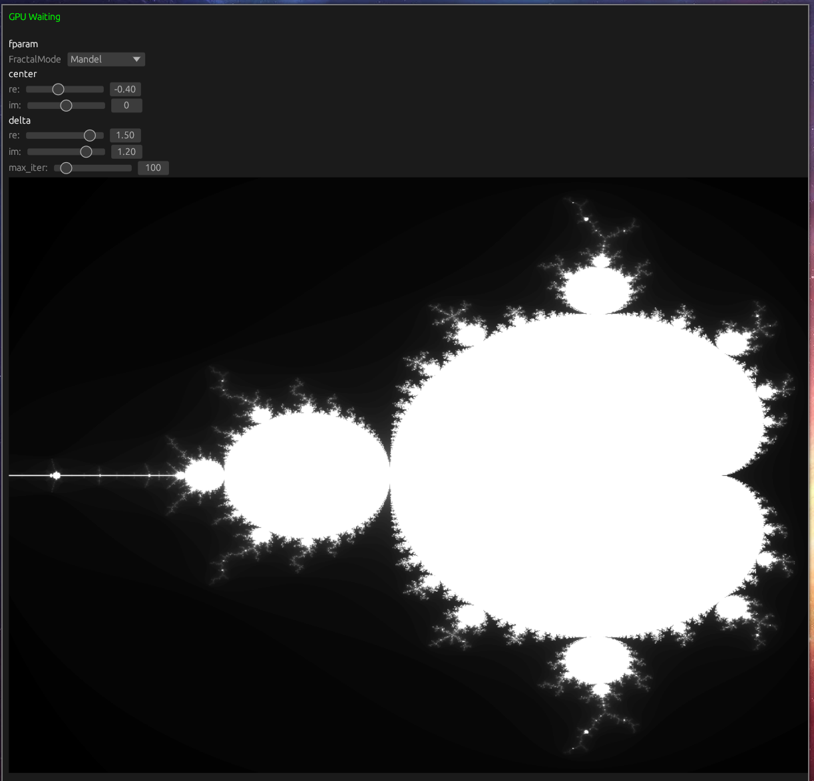
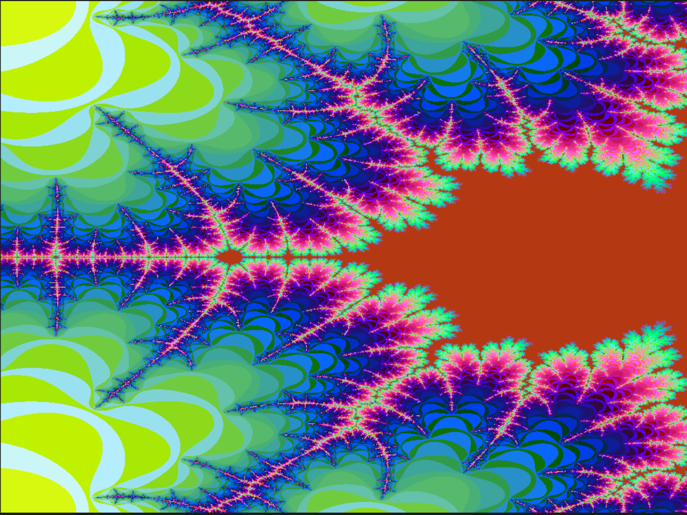

# Egui/OpenCL Fractals

Basic version of https://github.com/dmirauta/CLImFractal and https://github.com/dmirauta/pocl-mandel.

The idea is to expose necessary visualisation controlls with minimal GUI code (using mostly elements auto-generated through EguiInspect).

