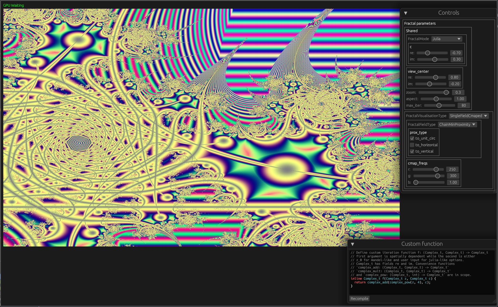

# Egui/OpenCL Fractals

Recreation (incomplete) of https://github.com/dmirauta/CLImFractal (and older https://github.com/dmirauta/pocl-mandel).

The idea is to expose necessary visualisation controlls with minimal GUI code (using mostly elements auto-generated through [EguiInspect](https://github.com/dmirauta/egui_inspect)).

